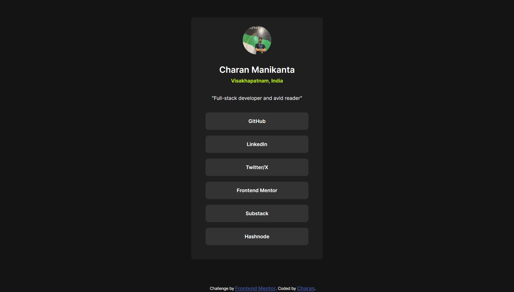

# Frontend Mentor - Social links profile solution

This is a solution to the [Social links profile challenge on Frontend Mentor](https://www.frontendmentor.io/challenges/social-links-profile-UG32l9m6dQ). Frontend Mentor challenges help you improve your coding skills by building realistic projects. 

## Table of contents

- [Frontend Mentor - Social links profile solution](#frontend-mentor---social-links-profile-solution)
  - [Table of contents](#table-of-contents)
  - [Overview](#overview)
    - [The challenge](#the-challenge)
    - [Screenshot](#screenshot)
    - [Links](#links)
  - [My process](#my-process)
    - [Built with](#built-with)
    - [What I learned](#what-i-learned)
    - [Continued development](#continued-development)
  - [Author](#author)

## Overview

### The challenge

Users should be able to:

- See hover and focus states for all interactive elements on the page

### Screenshot



### Links

- Solution URL: [Solution](https://github.com/CharanMN7/social-links)
- Live Site URL: [Live Site](https://charanmn7.github.io/social-links/)

## My process

### Built with

- HTML
- CSS
- Flexbox
- Mobile-first workflow

### What I learned

I learned about variable fonts and imported the provided variable font to use it in the CSS code to style the HTML element (I wrote an article about this some time ago and I had to refer back to it after about a year!).

Here's how I did it:

```css
@font-face {
  font-family: "Inter";
  src: url("./assets/fonts/Inter-VariableFont_slnt,wght.ttf");
  font-weight: 100 900;
}
```

I put the color values and the `border-radius` value in CSS variables to make them resubale.

### Continued development

In this challenge, I tried a lot to center the `<div>` vertically. But, the approaches I came across searhes didn't quite satisfy me. I wish to look more into that.

## Author

- Website - [Charan](https://charanmn7.github.io/social-links)
- Frontend Mentor - [Charan's Profile](https://www.frontendmentor.io/profile/CharanMN7)
- Twitter - [@CharanMNX](https://www.twitter.com/CharanMNX)
